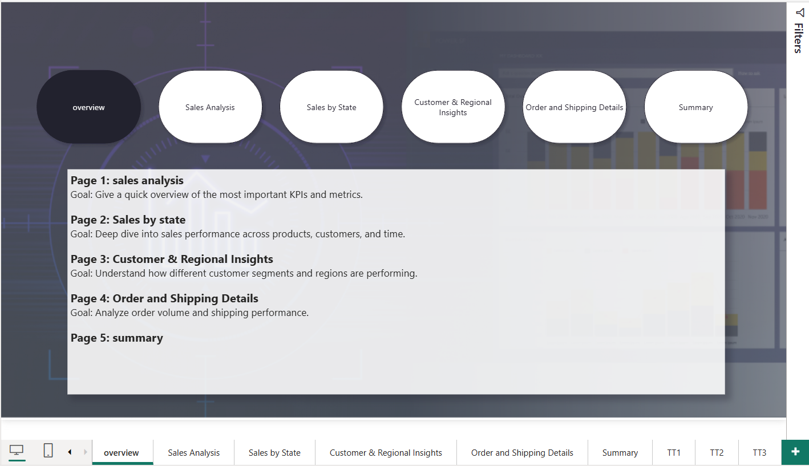
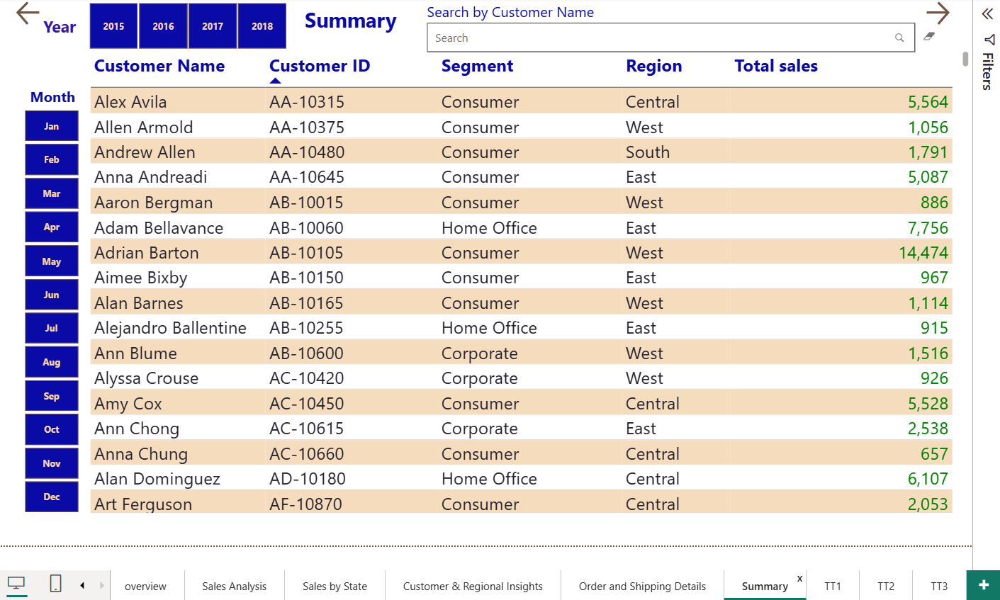

## Superstore-Sales-Analysis

## Overview
his project analyzes the Superstore dataset to uncover insights about sales, profit, and customer behavior.
Dashboards were created in Power BI, and Python were used for data cleaning and analysis.

## Tools used
*python(pandas,Matplotlib)
*Excel
*powerquery
*Power Pi

## Dashboards

## Presentaion
[Presentaion](superstore%20sales%20presentation.pptx)

## Dataset
[Superatore Sales DatasetDataset](Superstore%20Sales%20Dataset.csv")

## Documentation
[Documentation](Project%20Documentaion.docx)
